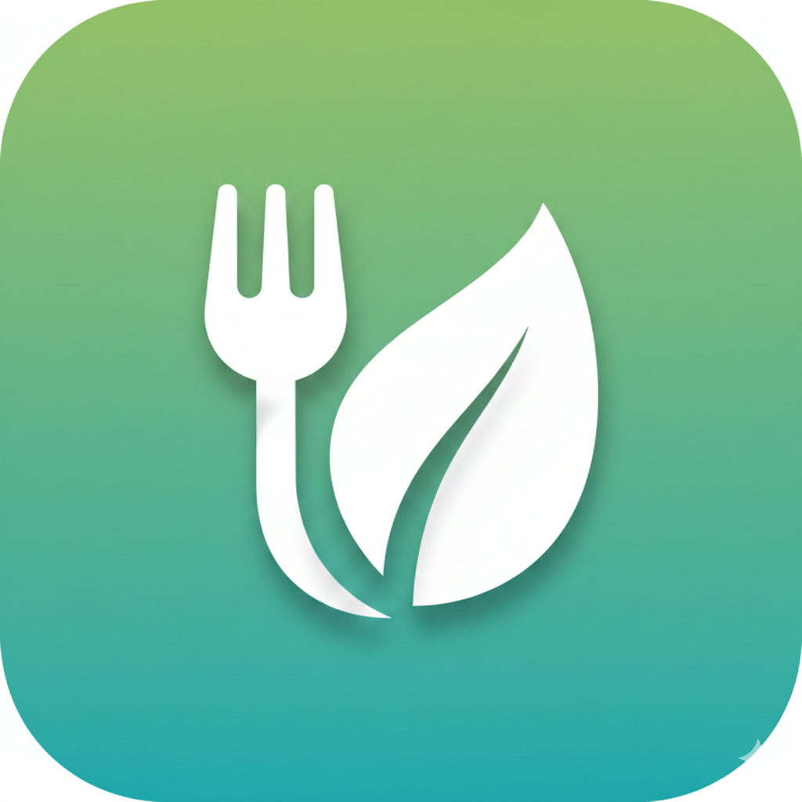

# FoodBuddy



FoodBuddy is an iOS meal logger with meal-first history, editable meal timestamps, and iCloud sync for both meal metadata and meal photos.

## Overview

FoodBuddy is currently focused on:

- Meal-first logging with multi-photo capture (`1..8` photos), note-only meals, and meal-type organization.
- AI-assisted meal analysis (Mistral) with user notes, background processing, and retry flow.
- Diet Quality Score (DQS) tracking with AI food categorization, in-app category/portion guidance, and manual add/edit/delete of food items.
- SwiftData persistence with CloudKit private-database sync behavior and local fallback.
- iPhone and iPad adaptive UI, with automated unit/UI regression coverage.

Major work items are tracked in `docs/NNN-plan-*.md` (latest completed: `docs/012-plan-dqs-category-help.md`).

## Diet Quality Score Attribution

The DQS feature is inspired by *Racing Weight* by Matt Fitzgerald.

## Development Requirements

> `FoodBuddy.xcodeproj` is **not checked into git** — it is generated from `project.yml`. Run `xcodegen generate` after cloning or pulling.

### Required

- macOS with Xcode 26.2+
- Swift 6.2+ (bundled with Xcode)
- `xcodegen` (project generation)

### Recommended

- `xcbeautify` (clean test/build logs)
- `gh` (GitHub workflows and PR operations)

### Install Tooling (Homebrew)

```bash
brew install xcodegen xcbeautify gh
```

### Verify Tooling

```bash
xcodebuild -version
swift --version
xcodegen --version
gh --version
```

## Local Test Workflow

```bash
# Regenerate project from project.yml
xcodegen generate

# Guardrail: fail fast if launch-screen metadata is missing
./scripts/assert-launch-screen-config.sh

# Build app target without signing (CI-style gate)
xcodebuild build -project FoodBuddy.xcodeproj -scheme FoodBuddy -destination 'generic/platform=iOS' CODE_SIGNING_ALLOWED=NO | xcbeautify

# Fast verifier tests (no iOS simulator required)
xcodebuild test -project FoodBuddy.xcodeproj -scheme FoodBuddy -destination 'platform=macOS,arch=x86_64' | xcbeautify

# Capture presentation UI regression tests (mock camera path)
xcodebuild test -project FoodBuddy.xcodeproj -scheme FoodBuddyUITests -destination 'platform=iOS Simulator,name=iPhone 17' -only-testing:FoodBuddyUITests/CapturePresentationUITests | xcbeautify

# DQS flow UI regression tests (score view + add/edit/delete)
xcodebuild test -project FoodBuddy.xcodeproj -scheme FoodBuddyUITests -destination 'platform=iOS Simulator,name=iPhone 17' -only-testing:FoodBuddyUITests/DQSFlowUITests | xcbeautify

# Verify local-phone scheme also builds
xcodebuild build -project FoodBuddy.xcodeproj -scheme FoodBuddyDev -destination 'generic/platform=iOS' CODE_SIGNING_ALLOWED=NO | xcbeautify
```

If `xcbeautify` is not installed, run the same `xcodebuild test` commands without the pipe.

## Run on iOS Simulator

1. Generate and open the project:

```bash
xcodegen generate
open FoodBuddy.xcodeproj
```

2. In Xcode, choose scheme `FoodBuddy` and an iOS simulator device.
3. Press `Cmd+R`.

Notes:

- Camera is usually unavailable in simulator; use **Choose from Library**.
- Drag image files into the simulator Photos app to seed test data.
- CLI option to seed Photos app: `xcrun simctl addmedia "iPhone 17" ~/Downloads/example1.png`.

## iPad Smoke Validation (Required Pre-Merge)

Run these checks on an iPad simulator before merge (portrait + landscape where noted):

1. Browse meals -> select meal -> select entry -> edit `loggedAt` -> save.
2. Switch meals and entries repeatedly in landscape split view; verify selection remains stable.
3. Delete an entry from detail and verify selection/navigation recovers cleanly.
4. Open **Photo Sync Details** and **Meal Types** from toolbar.
5. Complete one **Choose from Library** ingest flow end-to-end.
6. Trigger **Retry Photo Sync** on a failed asset (or verify retry control is hidden when no failures exist).


## Run on Your iPhone

Recommended default path uses scheme `FoodBuddyDev` (local-only mode, no CloudKit entitlement).

1. Regenerate/open:

```bash
xcodegen generate
open FoodBuddy.xcodeproj
```

2. In Xcode, select scheme `FoodBuddyDev` and your iPhone as destination.

3. In Xcode -> target `FoodBuddyDev` -> Signing & Capabilities:
- Enable **Automatically manage signing**.
- Select your Team (Personal Team works for local install).

4. Enable Developer Mode on iPhone (first time only):
- Try one run from Xcode first.
- On iPhone: `Settings -> Privacy & Security -> Developer Mode` -> enable, reboot, confirm.

5. Select your iPhone as destination and press `Cmd+R`.

Result: app runs on phone with local metadata fallback (no iCloud sync).

Suggested manual iPhone smoke checks:

1. Capture a meal with 1-2 photos and verify save completes.
2. Add a note-only meal (no photo) and verify it appears in History.
3. Open the day in History and confirm DQS badge + Daily DQS screen render.
4. Swipe-delete one meal in History and verify the list updates.
5. Add/edit/delete one manual food item and verify daily score updates each time.
6. Swipe-delete one food item from Daily DQS or Meal Detail and verify score updates.
7. If API key is configured in **AI Settings**, run note-only re-analysis and verify AI description + food items update.

Optional CloudKit-enabled phone run:

1. Use scheme `FoodBuddy` (production app target with CloudKit entitlement).
2. Configure signing for target `FoodBuddy` with your Team.
3. Ensure bundle/container identifiers remain consistent with the baseline in `AGENTS.md`.
4. Run on device and verify iCloud-backed sync behavior.

For signing/cert/profile details, see `docs/APPLE_DEV_BASICS.md`.

## Project Layout

```text
FoodBuddy/
  App/
  Domain/
  Features/
  Services/
  Storage/
  Support/
FoodBuddyCoreTests/
FoodBuddyUITests/
docs/
```

## License

MIT. See `LICENSE`.
